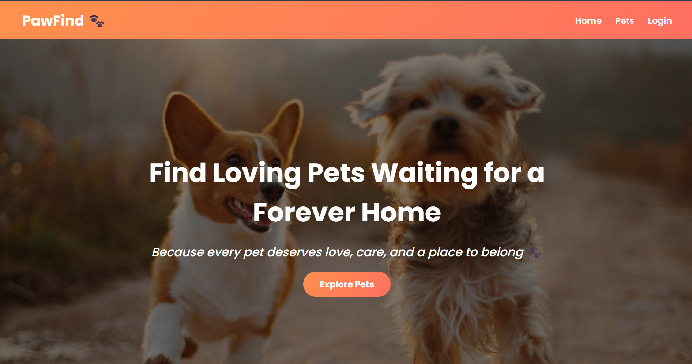
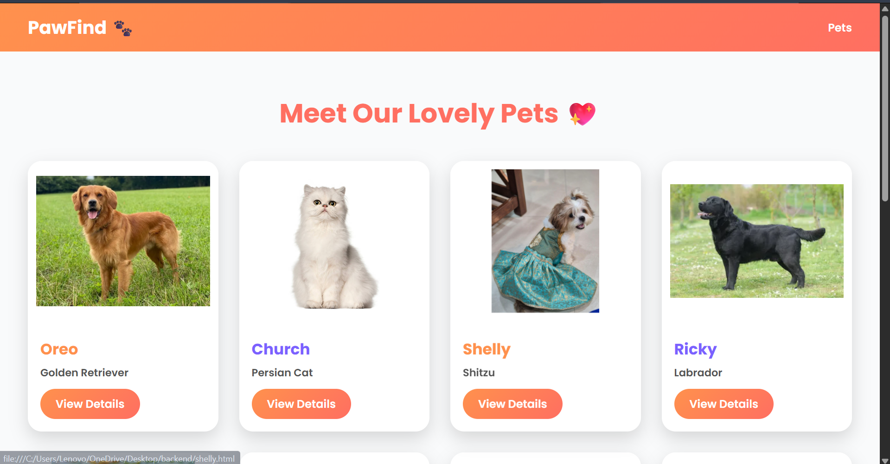
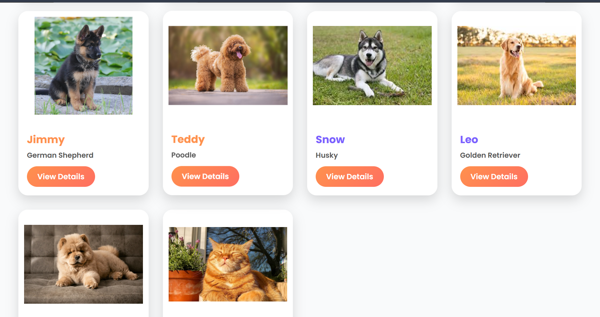
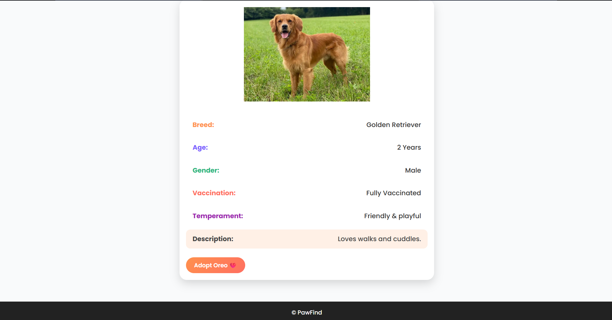
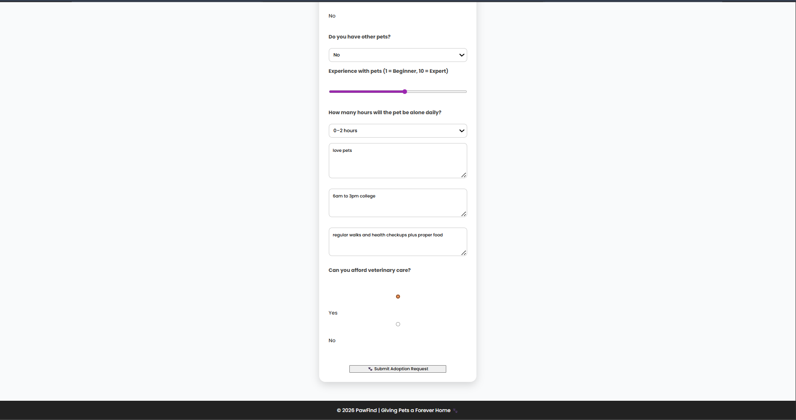
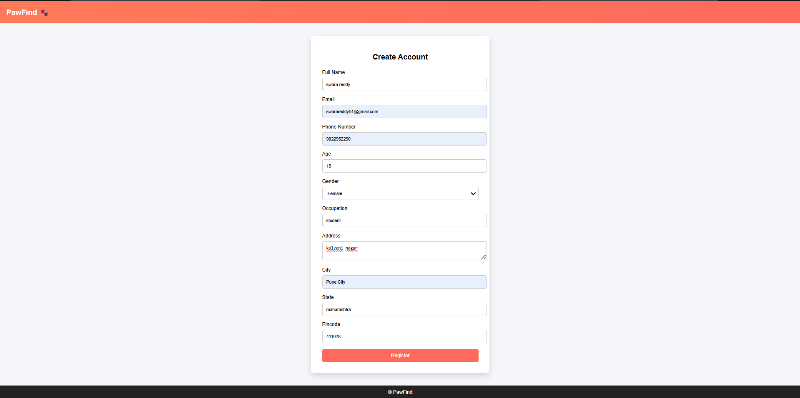
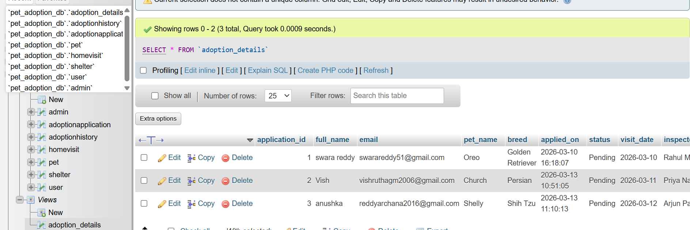

# pet-adoption-website# -PawFind – Pet Adoption Web Application

##  Project Overview

**PawFind** is a full-stack web application designed to simplify the pet adoption process by connecting users with shelters. The platform allows users to explore available pets, submit adoption applications, and track the adoption process through a structured database system.



---

##  Features

###  User Features

* View available pets with images and details
* Register and login
* Submit adoption application forms
* Provide detailed adoption preferences


 


###  Adoption Process

* Adoption application stored in database
* Home visit inspection system
* Approval/rejection workflow
* Adoption history tracking





###  Database Features



* Fully normalized relational database

* Multiple tables with relationships:

  * User
  * Pet
  * AdoptionApplication
  * HomeVisit
  * AdoptionHistory
  * Shelter
  * Admin

* Use of:

  * Primary & Foreign Keys
  * JOIN queries
  * Views

---

##  Technologies Used

### Frontend

* HTML5
* CSS3
* JavaScript

### Backend

* Node.js
* Express.js

### Database

* MySQL (XAMPP / phpMyAdmin)

---

##  System Architecture

```
Frontend (HTML/CSS/JS)
        ↓
Node.js (Express API)
        ↓
MySQL Database
```

---

## Database Design

Key relationships:

* One user → Many adoption applications
* One pet → Many applications
* One application → One home visit
* One application → One adoption history record

---

##  How to Run the Project

###  Start XAMPP

* Start Apache
* Start MySQL

###  Setup Database

* Open phpMyAdmin
* Create database: `pet_adoption_db`
* Run SQL scripts (tables + insert data)

###  Run Backend

```bash
cd backend
npm install
node server.js
```

###  Open Frontend

Open in browser:

* `pets.html`
* `login.html`
* `adopt.html`

---
## 🚀 Getting Started

### Clone the Repository

```bash
git clone https://github.com/Swara-Reddy/pet-adoption-website.git
```

### Navigate to the Project

```bash
cd pet-adoption-website
```

### Run the Project

1. Place the project folder inside the `htdocs` directory of XAMPP.
2. Start **Apache** and **MySQL** from the XAMPP Control Panel.
3. Import the provided SQL file into phpMyAdmin.
4. Open the project in your browser:

```text
http://localhost/pet-adoption-website
```

## Sample Workflow

1. User registers
2. User selects a pet
3. Adoption form submitted
4. Data stored in database
5. Home visit scheduled
6. Admin approves adoption
7. Entry added to AdoptionHistory

---

## Future Enhancements

* Authentication system (JWT)
* Admin dashboard
* Real-time adoption tracking
* Email notifications

---

## Author

**Swara Reddy**

---

##  Conclusion

This project demonstrates the practical implementation of **DBMS concepts**, **frontend-backend integration**, and **real-world application design** for managing pet adoption workflows.
